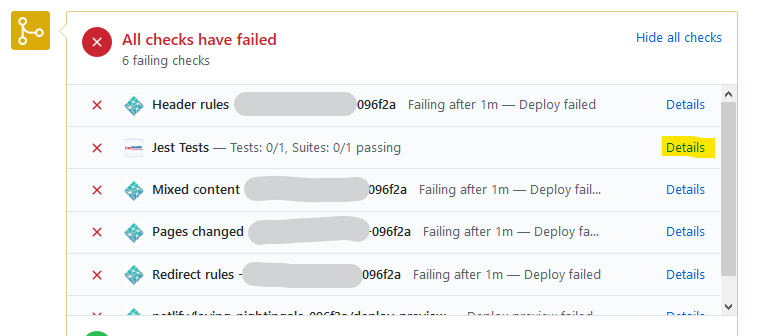

# Netlify Plugin - Jest

Netlify build plugin to run Jest unit tests and set a simple status in GitHub on
the commit that triggered the build. Failed tests will stop the build so no
build time is wasted.

Jest unit tests are run via a simple command line before the build (onPrebuild).
The json results are extracted to get some summary info. GitHub status messages
are set when tests start and with the summary when finished. If the tests fail,
the plugin **_cancels_** the build. If there are plugin or other errors the
build will be **_failed_**. Otherwise, the build will proceed.

The Github status details link will go to the Netlify deploy log, so someone can
see details on the failed tests or errors.

<details>
<summary><b>GitHub Status (testing failure):</b></summary>

</details>

## Install (manual)

```bash
npm install netlify-plugin-jest
```

## Usage

Add this plugin to the `plugins` array in your
[`netlify.toml` configuration file](https://docs.netlify.com/configure-builds/file-based-configuration):

```toml
[[plugins]]
package = "netlify-plugin-jest"

  [plugins.inputs]
  # all inputs for this plugin are required, but have default values
```

## Configuration

The plugin **requires** a GitHub personal access token to be set as an
_environment variable_ named **GITHUB_PERSONAL_TOKEN** . It is used to set a
simple GitHub repo status.

<details>
<summary>The following <b>input</b> options are available:</summary>

- **name**: testCommand
  - **description**: The command line used to trigger the tests and any other
    features. Separating this out allows for easier customization and future
    development. Change cautiously.
  - **default**: jest --collectCoverage --json --outputFile jest.results.json
  - **required**: true
- **name**: skipTests
  - **description**: Skip unit tests but leave the plugin present
  - **default**: false
  - **required**: true
- **name**: skipStatusUpdate
  - **description**: Skip Github status updates
  - **default**: false
  - **required**: true
- **name**: testFailureErrorMessage
  - **description**: String that exists inside of the error message indicating
    tests failed.
  - **default**: Command failed with exit code 1
  - **required**: true
- **name**: gitHubStatusName
  - **description**: Context/name for the status in GitHub, should be pretty
    unique
  - **default**: Jest Tests
  - **required**: true
- **name**: extraLogging
  - **description**: Display some extra console logging.
  - **default**: false
  - **required**: true

</details>

## Development

### Explanation of the plugin's logic

1. Checks if configured to skip tests

2. Sets a GitHub status of pending/running...

3. Run the testing command

4. Determine success, plugin error or testing failure. Testing failure is soley
   deteremined by the presence of the `testFailureErrorMessage` string in the
   error response. This is because all regular testing failures are still
   returned as errors.

5. If success: a. Set the GitHub status b. Continue on building

6. If testing failure: a. Parse the test results that are written to a _json_
   file and construct a short summary for the GitHub status. b. Set the GitHub
   status c. **Cancel** the Netlify build

7. If other error: a. Set the GitHub status b. **Fail** the Netlify build

### Develop Locally

The plugin can be developed locally most easily by including it as a relative
path in another locally functioning Netlify site that is linked to Netlify.

#### Example netlify.toml for local site to reference the local plugin (plugin-local-install-core is necessary)

```toml
[[plugins]]
package = "..\\netlify-plugins\\netlify-plugin-jest\\"

  [plugins.inputs]
  extraLogging = true

[[plugins]]
package = "@netlify/plugin-local-install-core"
```

Remember the GITHUB_PERSONAL_TOKEN needs to be set in the local Netlify site not
the plugin itself. This will allow `netlify build` on the Netlify site (not the
plugin) to run the plugin. It will also set the status on the commit for the the
site's repo if there is a pull request present. Not all Netlify environment
values are present locally: DEPLOY_URL etc.

### Testing plugin on an actual Netlify Build/Deploy without a released npm

The plugin can be tested without using an actual released **npm** package by
doing the following:

1. Figure out the branch/tag/commit etc of the plugin to test, and install it as
   a package in the Netlify site you will use for testing:
   `npm install UWHealth/netlify-plugin-jest#<branch/tag/commit>`

2. Change the Netlify site's toml configuration:

   ```toml
   [[plugins]]
   package = "./node_modules/netlify-plugin-jest"

     [plugins.inputs]
     extraLogging = true

   [[plugins]]
   package = "@netlify/plugin-local-install-core"
   ```

3. Make sure to clear the build/deploy cache when you build/redeploy the testing
   site on Netlify. This will pull down a clean copy of the plugin code from the
   branch/tag/commit specified in the package.json after the `npm install`.

4. Uninstall the Github sourced npm afterwards if the site is to be used for
   production purposes.

## Future Ideas

- Configure the plugin to use a Github App.

- Set test failure information as annotations on files in the form of more
  advanced GitHub Status Check.

- Display Jest testing coverage information on GitHub repo.
